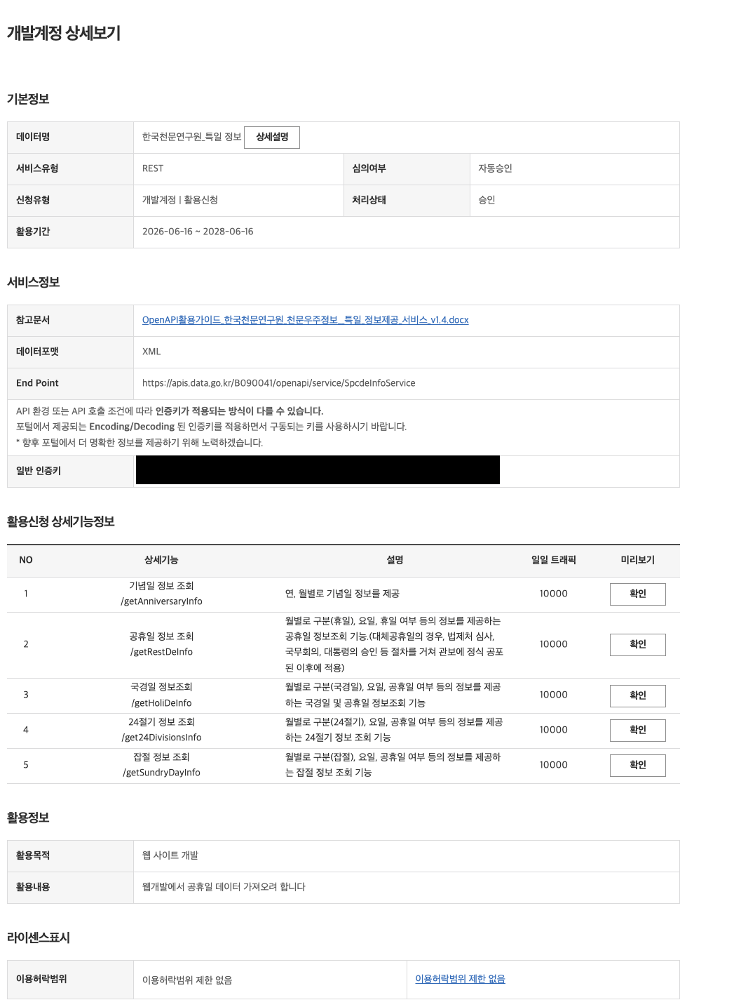

# remote-dj

여러 사람이 **한 대의 "재생용 폰"에서 흐르는 음악을 원격으로 함께 조작**하는 협업형 음악 컨트롤러입니다.
음악은 YouTube 링크 기반으로 추가되며, 곡을 바꾸거나 음량을 조절할 때 **사유(메모)** 를 남길 수 있어
"왜 이 곡으로 바꿨는지 / 왜 소리를 줄였는지"를 다른 사람이 확인할 수 있습니다.

> 상태: 🚀 동작하는 구현체 (모노레포 + 실시간 동기화 + QA 자동화). 서버는 셀프호스트(컴퓨터/안드로이드 Termux)로 누구나 포크해 실행 가능.

## 빠른 시작 (Quickstart)

```bash
npm install
npm run dev          # 서버(:3001) + 웹(:3000) 동시 기동
```

- 같은 Wi-Fi의 다른 폰에서 `http://<이 컴퓨터 IP>:3000` 으로 접속 (클라이언트가 서버 URL을 런타임에 자동 계산 → 재빌드 불필요)
- Player 폰은 브라우저에서 YouTube 로그인 후 `/player` 진입, Controller는 `/controller`
- 상세 실행(컴퓨터 / 안드로이드 Termux / 공개 터널)·검증: [docs/DEPLOYMENT.md](./docs/DEPLOYMENT.md)

| 문서 | 내용 |
| --- | --- |
| [docs/SPEC.md](./docs/SPEC.md) | 기능·WebSocket 프로토콜·검증 규칙·Activity Log 계약 |
| [docs/ARCHITECTURE.md](./docs/ARCHITECTURE.md) | 모노레포 구조·동기화 모델·RoomStore·타입 공유 |
| [docs/DEPLOYMENT.md](./docs/DEPLOYMENT.md) | 컴퓨터/Termux/터널 실행 + 포크 체크리스트 |
| [docs/qa/](./docs/qa/) | 수용기준(Given/When/Then) — 격리 블랙박스 테스트의 기준 |

## 자동 재생 예약 / 한국 공휴일 스킵

Player의 **예약(스케줄)** 으로 요일·시간대를 정하면 서버가 그 시간에 맞춰 **자동으로
재생을 켜고 끕니다**. 평가는 모두 **한국 시간(Asia/Seoul, KST)** 기준입니다.

예약 편집에서 **"한국 공휴일에는 자동 재생 쉬기"** 를 켜면, 한국 공휴일(대체공휴일
포함)에는 자동 재생을 건너뜁니다. 방별 설정이며 **기본 OFF**(기존 방은 영향 없음 —
켜려면 Player가 예약을 다시 저장).

**공휴일 데이터 소스 (서버단, 2단계)**

1. **번들 정적 목록** (기본 · 오프라인) — `apps/server/src/holidays.ts` 에 2026·2027
   공휴일을 검증해 내장. 키·네트워크 없이 동작. 음력 명절·대체공휴일·제헌절(2026
   재지정) 포함. *연 1회* 다음 해 날짜를 추가해야 하며, 미달 시 유닛 테스트가 실패합니다.
2. **KASI 공식 API** (선택) — `DATA_GO_KR_SERVICE_KEY` 를 주면 부팅 시 data.go.kr
   "특일정보"(getRestDeInfo)에서 올해+내년 공휴일을 받아 **`apps/server/.data/holidays.json`
   에 저장**하고 정적 목록과 합쳐 씁니다(대체·임시공휴일 자동 포착). **API 호출은 연 1회
   수준**으로 최소화됩니다(캐시가 해당 연도를 못 덮거나 ~300일 지나야 재요청). 키가
   없거나 호출이 실패하면 **정적 목록만으로 정상 동작**합니다.

**API 키 발급 (data.go.kr)** — KASI(2단계)를 쓰려면 무료 키를 받는다.

1. [공공데이터포털(data.go.kr)](https://www.data.go.kr) 로그인 → **"특일정보"** 검색.
2. **한국천문연구원_특일 정보** REST 서비스에서 **활용신청**(심의 없이 **자동승인**).
3. 승인되면 상세보기의 **"일반 인증키"** 를 복사. 일일 트래픽 10,000회, 활용기간 2년.
   `getRestDeInfo`(공휴일 정보 조회)가 대체공휴일까지 내려준다.



> 위 화면의 **일반 인증키** 한 줄을 그대로 `.env` 에 넣으면 된다(이미지의 키 부분은
> 보안상 가려둠). Encoding/Decoding 어느 형태든 서버가 자동 판별한다.

**설정** — `apps/server/.env` (gitignore 대상, `apps/server/.env.example` 참고):

```bash
# apps/server/.env  — KEY=VALUE 형식, 한 줄에 하나, 따옴표 불필요 (gitignore 대상)

# data.go.kr → "특일정보" 검색 → 활용신청(자동승인) → 마이페이지의 "일반 인증키"
# Encoding/Decoding 어느 형태든 그대로 붙여넣으면 된다(서버가 자동 판별)
DATA_GO_KR_SERVICE_KEY=여기에_일반_인증키_붙여넣기

# (선택) 임시공휴일 즉시 추가 / 특정일은 평소처럼 재생 — 쉼표구분 YYYY-MM-DD, 서버 전역
EXTRA_HOLIDAYS=2026-10-02,2027-03-02
HOLIDAY_OVERRIDES_OFF=2026-06-03
```

키를 채운 뒤 서버를 재시작하면 적용됩니다. 데이터 캐시 `apps/server/.data/holidays.json`
는 `.data/` 가 gitignore 대상이라 커밋되지 않으며 릴리즈(재빌드)에도 보존됩니다.

> 참고: KASI 키를 쓰면 API가 **근로자의날(5/1)** 도 공휴일로 내려줘 자동 재생을 쉰다
> (번들 정적 목록엔 관공서 공휴일만 있어 5/1이 없다). 그날 음악을 틀려면
> `HOLIDAY_OVERRIDES_OFF=2026-05-01,2027-05-01` 로 제외한다.

## 개발 / 품질 게이트

```bash
npm run typecheck    # 3개 워크스페이스 tsc
npm run lint         # Biome(포맷+린트) + ESLint(web, next/core-web-vitals)
npm test             # Vitest 유닛 + Socket.IO 통합
npm run e2e -w apps/web   # Playwright 멀티컨텍스트 E2E (웹 블랙박스)
# 서버 블랙박스(별도 런타임): qa/server (python-socketio + pytest)
```

## 핵심 개념

시스템에는 두 종류의 역할이 있습니다.

| 역할 | 설명 |
| --- | --- |
| **Player (재생용 폰)** | 실제로 음악을 재생하는 단말. 재생/조작을 위해 **YouTube 로그인이 필요**. 컨트롤러가 보낸 설정에 따라 곡·음량이 바뀜 |
| **Controller (조작 유저들)** | 여러 명이 동시에 접속해 곡 변경 / 음량 조절 / 설정을 수행. **휴대폰 화면 기준의 반응형 웹** |

## 기능 요구사항

1. **연결** — 하나의 Player 폰에 여러 Controller가 연결되고, Player는 컨트롤러의 설정에 따라 실시간으로 반영된다.
2. **곡 변경 + 사유** — 현재 재생 중인 곡을 바꿀 때는 **사유 입력을 필수**로 한다.
3. **사유는 선택(기본 익명)** — 음량 조절·설정 변경은 기본 익명으로 동작하며, 사유는 *선택적으로* 남길 수 있다.
   남기면 다른 유저가 변경 이유를 확인할 수 있다.
4. **YouTube 기반 재생** — 곡은 보통 YouTube 링크로 추가한다. Player 폰은 재생·조작을 위해 YouTube 로그인을 선행해야 한다.
5. **반응형 (모바일 우선)** — Controller 웹은 휴대폰 화면 크기를 기본으로 제공하는 반응형 UI여야 한다.

## 동작 흐름 (개념)

```
[Controller A]  ┐
[Controller B]  ├──(곡 변경 / 음량 / 설정 + 선택적 사유)──▶  [동기화 계층]  ──▶  [Player 폰 / YouTube 재생]
[Controller C]  ┘                                              │
                                                               └──▶ 변경 이력 + 사유 피드 (모두에게 공유)
```

## 변경 이력 (Activity Log)

모든 조작은 이력으로 남는다. 곡 변경은 사유 필수, 그 외는 사유 선택.

| 필드 | 예시 |
| --- | --- |
| 시각 | 2026-05-29 21:13 |
| 행위자 | 익명 / (닉네임) |
| 종류 | 곡 변경 · 음량 · 설정 |
| 사유 | "분위기 띄우려고", "통화 중이라 줄임" |

## 결정 사항 (resolved)

- [x] 동기화 방식 — **Socket.IO** (서버가 권위 상태 보유, 전체 브로드캐스트)
- [x] Player ↔ Controller 페어링 — **방 코드**(+ 선택적 방 비밀번호). QR은 추후
- [x] YouTube 재생 — **IFrame Player API** (Player 폰 브라우저에서 로그인 선행)
- [x] 프런트엔드 스택 — **Next.js 15 + React 19 + Tailwind** (모바일 우선)
- [x] 인증/세션 — 기본 익명 + 선택 닉네임 + 선택적 방 비밀번호 (`allowAnonymous` 설정으로 곡 변경 시 닉네임 강제 가능)

### 구현된 기능

곡 변경(사유 필수) · 음량 · 재생/일시정지 · **재생 큐**(자동/수동 다음 곡) · **Seek**(진행바) · **설정**(allowAnonymous) · **주간 자동 재생 예약 + 한국 공휴일 스킵**(KST) · **YouTube 재생 오류/복원 UX** · 전체 Activity Log

### 추후 (비범위)

QR 페어링 · 영속 저장소(SQLite/Postgres) · 본격 인증

## 라이선스

[MIT](./LICENSE)
